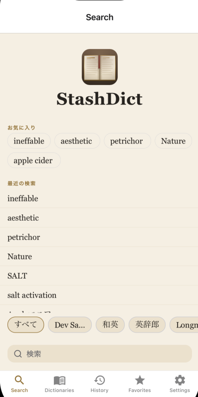
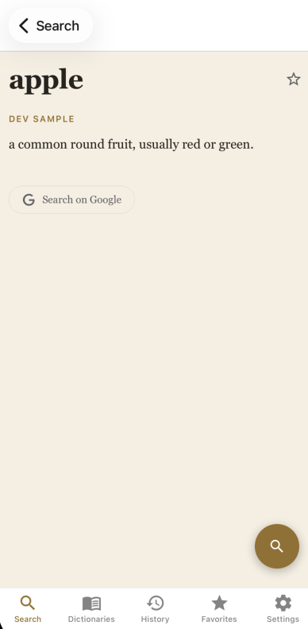
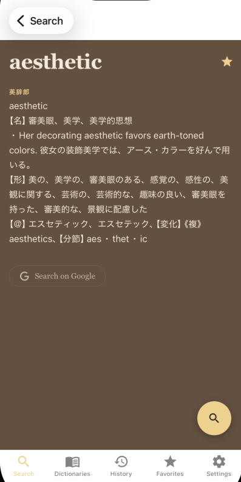
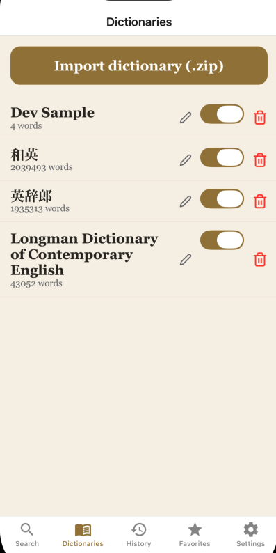
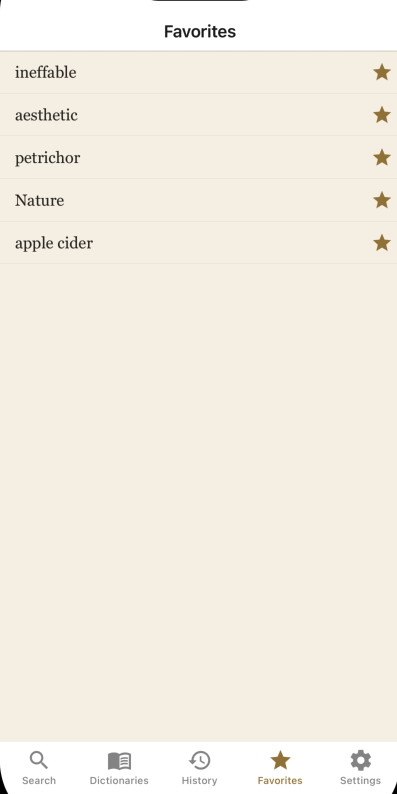
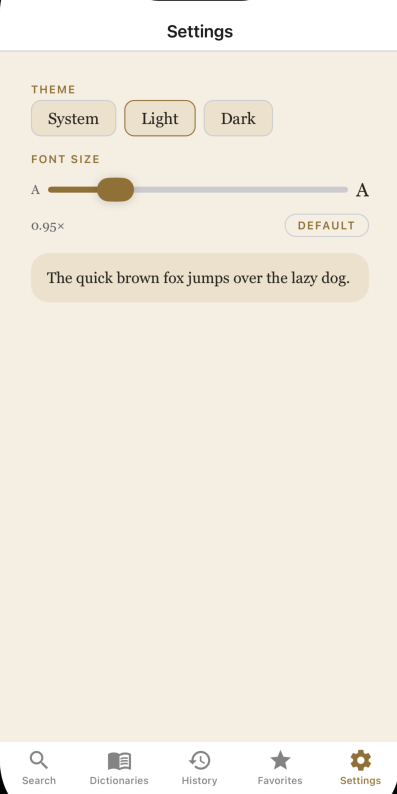

<p align="center">
  
</p>

<h1 align="center">StashDict</h1>

<p align="center">
  An offline iPhone dictionary. Import your own StarDict dictionaries and search
  them on your device.
</p>

<p align="center">
  
  
  
</p>
<p align="center">
  
  
  
</p>

## Technology

- App: React Native + Expo (TypeScript)
- Storage: SQLite

## What it does

- Import StarDict dictionaries and keep them on-device.
- Incremental prefix search across enabled dictionaries, synonyms included.
- Manage multiple dictionaries: enable, disable, reorder.
- Search history and favorites.
- Dark mode and live display settings.

## Design

Layered, each layer pure and tested behind an interface.

- `src/parser/` — format-agnostic StarDict parser.
- `src/folding/` — the search key: NFD, strip combining marks, lowercase, trim.
- `src/db/` — `Database` interface, two adapters (better-sqlite3 for tests,
  op-sqlite at runtime), import engine, search, repositories.
- `src/features/` — UI slices over injectable services.

Logic is unit-tested against real SQLite. Native pieces are verified on a Dev
Client. See [SPEC.md](SPEC.md), [UI_SPEC.md](UI_SPEC.md), [CONTEXT.md](CONTEXT.md),
and `docs/adr/` for the rest.

## Build

```bash
npm test                    # Jest suite
npx tsc --noEmit            # type-check
npx expo run:ios --device   # build onto a connected iPhone
```

## Status

MVP complete. iPhone only.
